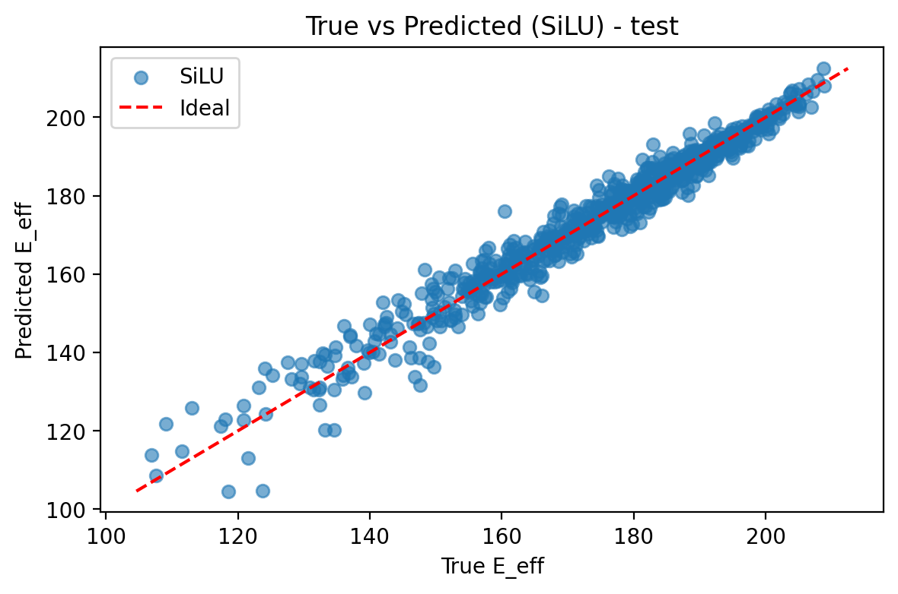
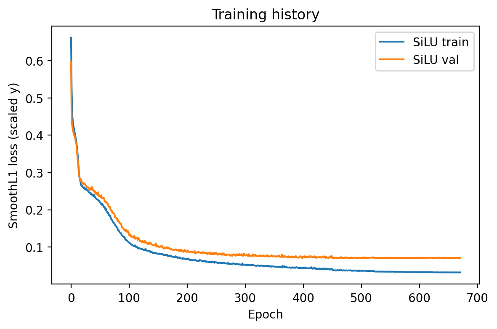
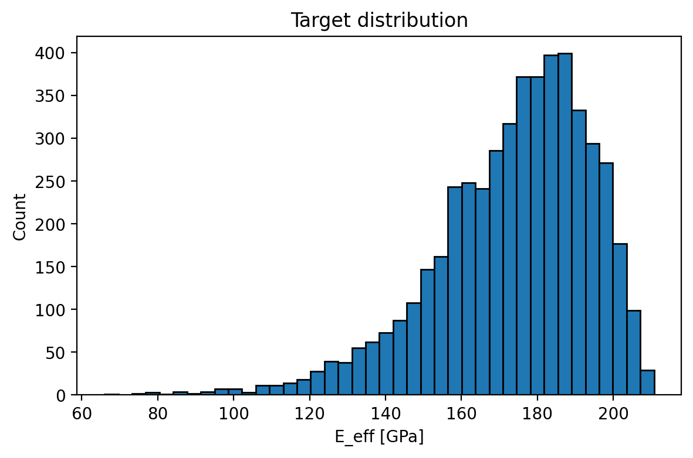
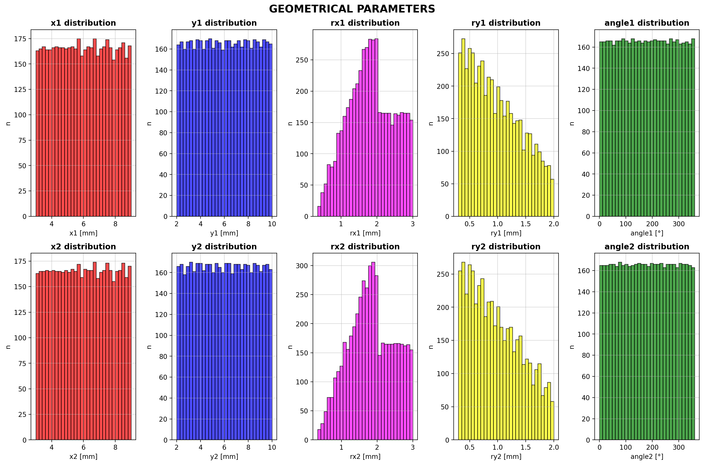
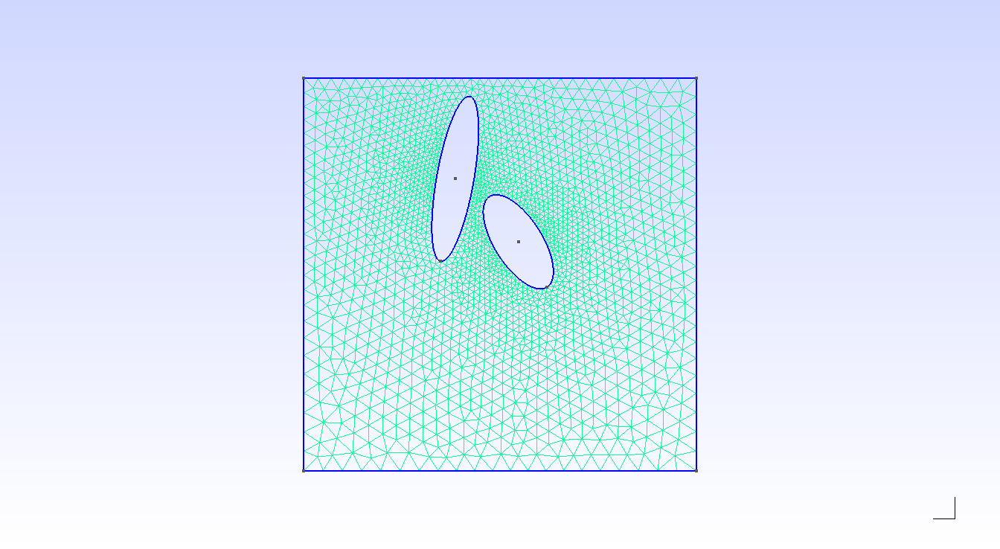
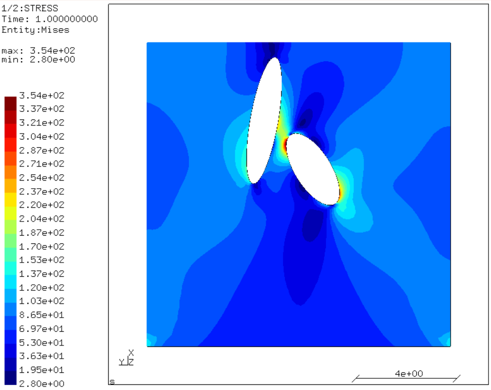
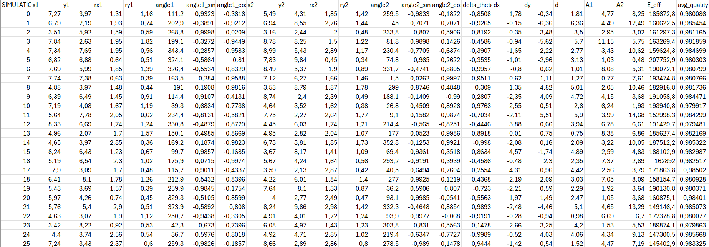

# Predicting Effective Young's Modulus with Neural Networks from Parametric FEA

This project automates the prediction of the **effective elastic properties** of a perforated 2D plate using a hybrid Finite Element Analysis (FEA) and Machine Learning approach.

The goal is to train a Feedforward Neural Network (FNN) to predict the **effective Young's modulus** $E_{\text{eff}}$ of a plate with two random elliptical holes directly from geometric parameters, bypassing computationally expensive FEM simulations for new geometries.

---

## Quickstart

### 1) Clone the repository
```bash
git clone https://github.com/AndreaVinars/Mesh---FEM---NN.git
cd Mesh---FEM---NN
```

### 2) Create a virtual environment + install Python dependencies
Windows (PowerShell)
```bash
python -m venv .venv
.\.venv\Scripts\Activate.ps1
python -m pip install --upgrade pip
pip install -r requirements.txt
```
```bash
Linux / macOS

python3 -m venv .venv
source .venv/bin/activate
python -m pip install --upgrade pip
pip install -r requirements.txt
```
### 3) Create your config file
Copy the example config and edit the CalculiX path:

Windows (PowerShell)
```bash
Copy-Item config.example.yaml config.yaml
notepad config.yaml
```
```bash
Linux / macOS

cp config.example.yaml config.yaml
nano config.yaml
```
### 4)Run FEM simulations (dataset generation)
python Pipeline/simulation.py config.yaml

Expected outputs:

data/ml_data.csv (aggregated dataset)

data/param_histograms.png

logs/main.log + per-simulation logs

5) Train the neural network
python Pipeline/FNN.py

Expected outputs:

plots/*.png (training curves, scatter plot, etc.)

optionally logs/train_*.log

---

## Results (baseline)

Metrics obtained on a dataset of **5000 FEM simulations** using the baseline configuration in `config.example.yaml`.

- **RMSE:** 3.792740 GPa
- **MAE:**  2.728667 GPa

### Prediction quality (test set)


### Training curves


### Target distribution


### Input parameter distributions


### Mesh example (Gmsh)


### FEM view (CalculiX/CGX)


### Dataset snapshot


---

## Repository structure

- `parametric_ellipses.py` — basic parametric FEA, without post-processing
- `fixed_ellipses.py` — manual input of dimensions, FEA + post-processing
- `Pipeline/`
  - `FNN.py` — neural network training + evaluation (plots + metrics)
  - `simulation.py` — runs FEM analyses for each generated geometry (CalculiX)
  - `data_processing.py` — post-processing + dataset creation (CSV)
- `docs/figures/` — figures used in the README
- `config.example.yaml` — example configuration
- `requirements.txt` — Python dependencies

---

## Project Status

- [x] **Phase 1:** Parametric geometry & mesh generation (Gmsh)
- [x] **Phase 2:** FEM simulation + homogenization (CalculiX)
- [x] **Phase 3:** Dataset generation (CSV) + baseline FNN training & evaluation
- [ ] **Phase 4 (in progress):** Inference interface + final polish
  - [ ] Add a user-facing prediction function (input: geometry parameters → output: predicted $E_{\text{eff}}$)
  - [ ] Improve FNN accuracy (hyperparameter tuning / feature engineering / training strategy)
  - [ ] Add debug utilities for rejected geometries (mesh quality / solver failures / filtering reasons)

---

## Project Pipeline

The workflow integrates four main stages:

### 1. Parametric Mesh Generation (GMSH)

Automated generation of 2D rectangular plates with two elliptical holes.

**Geometric Parameters (per hole):**
- Position: $x, y$ (center coordinates)
- Semi-axes: $r_x, r_y$ (semi-major and semi-minor axis lengths)
- Orientation: $\theta$ (rotation angle)

Each configuration is randomized and stored with an associated mesh file (.msh).

### 2. FEM Simulation (CalculiX)

For each geometry, CalculiX solves the linear elastic problem:

**Problem Setup:**
- Material: Isotropic, constant $E_{\text{mat}}$, constant Poisson's ratio $\nu$
- Boundary Condition: Prescribed displacement $u$ on plate edges
- Solver: Assembles global stiffness matrix $\mathbf{K}$ from element matrices and solves the linear system $\mathbf{K}\mathbf{u} = \mathbf{F}$ for nodal displacements $\mathbf{u}$.

From the displacement field, stresses and strains are evaluated at Gauss integration points across all elements.

### 3. Homogenization & Data Extraction

**Volume Averaging:**
- Average stress: $\bar{\boldsymbol{\sigma}} = \frac{1}{V}\int_V \boldsymbol{\sigma} \, dV$
- Average strain: $\bar{\boldsymbol{\varepsilon}} = \frac{1}{V}\int_V \boldsymbol{\varepsilon} \, dV$

**Effective Young's Modulus Calculation:**

The effective modulus is obtained from the ratio of homogenized stress to applied strain:

$$E_{\text{eff}} = \frac{\bar{\sigma}_{xx}}{\bar{\varepsilon}_{xx}}$$

**Homogenized Stress** (area-weighted average):

$$\bar{\sigma}_{xx} = \frac{\sum_{i} \sigma_{xx,i} \cdot A_i}{\sum_{i} A_i}$$

Where:
- $\sigma_{xx,i}$ = Axial stress of element $i$ (from CalculiX `.dat` file)
- $A_i$ = Area of element $i$ (computed from nodal coordinates in `.inp` file)

**Applied Strain** (prescribed boundary condition):

$$\bar{\varepsilon}_{xx} = \frac{\text{elongation}}{\text{plate width}}$$

**Implementation:**
The `calculate_youngs_modulus()` function parses the mesh and stress files, computes element areas using the cross-product formula, performs area-weighted averaging of Sxx stresses, and divides by the applied strain to obtain $E_{\text{eff}}$.

**Assumptions:**
- Linear elastic regime (small strains)
- Plane stress conditions  
- Homogenization: Effective modulus links average stress to applied (nominal) strain
- Uniform boundary displacement (prescribed elongation)

### 4. Neural Network (training vs inference)

- **Training input (17 features):** the network is trained on an extended feature set that includes
  derived quantities (e.g., `sin/cos` of angles, relative distances, areas).
- **Planned inference input (10 parameters):** the user will provide only the basic ellipse geometry:
  `x1, y1, rx1, ry1, angle1, x2, y2, rx2, ry2, angle2`.
  The missing 7 features will be computed internally before running the prediction.


**Target Output:**

$$E_{\text{eff}}$$

A regression FNN learns the mapping from geometry to effective Young's modulus.

---

## Dataset & Training

### Dataset
- The dataset is stored as a CSV file (not included in the repository).
- Expected location (default in `Pipeline/FNN.py`): `./data/ml_data.csv`
- Target: $E_{\text{eff}}$ (values are scaled to GPa in the training script via `/1000`).

### Model inputs
- **Training input (17 features):** an extended feature vector including derived quantities
  (e.g., `sin/cos` of angles, relative distances, and areas).
- **Planned inference input (10 parameters):** the user will provide only the basic ellipse geometry:
  `x1, y1, rx1, ry1, angle1, x2, y2, rx2, ry2, angle2`.
  The remaining 7 features will be computed internally before prediction.

### Training setup (baseline)
- Split: 70/15/15 (train/val/test), shuffle enabled
- Preprocessing: `StandardScaler` fitted on the training set only
- Loss: Smooth L1 (Huber) loss with `beta=0.2`
- Optimizer: AdamW
- LR scheduling: ReduceLROnPlateau
- Early stopping: based on validation loss

### Outputs
- Best model weights: `models/`
- Plots: `plots/`
- Logs: `logs/`


## Mathematical Foundations

### Global Stiffness Matrix ($\mathbf{K}$)

The global stiffness matrix is the assembled collection of all element stiffness matrices. Its role:
- Relates applied forces to resulting displacements: $\mathbf{F} = \mathbf{K} \mathbf{u}$
- Encodes the full mechanical response of the structure
- Boundary conditions are enforced by modifying rows/columns corresponding to constrained DOFs
- Once assembled and boundary conditions applied, solving $\mathbf{K} \mathbf{u} = \mathbf{F}$ yields the full displacement solution

### From Element to Global: FEM Pipeline

1. **Element Level:** Each triangular element computes $\mathbf{K}^{(e)}$ using strain-displacement matrix $\mathbf{B}^{(e)}$ and material stiffness $\mathbf{C}$.
2. **Global Assembly:** All element matrices are summed into $\mathbf{K}$ at global DOF locations.
3. **Solution:** With boundary conditions applied, the system is solved for $\mathbf{u}$.
4. **Post-Processing:** Strains $\boldsymbol{\varepsilon} = \mathbf{B} \mathbf{u}$ and stresses $\boldsymbol{\sigma} = \mathbf{C} \boldsymbol{\varepsilon}$ are computed at Gauss points.
5. **Homogenization:** Volume-averaged stresses and strains feed into the constitutive identification.

---

## Author

**Andrea Vinarš**  
Email: andrea.vinars3@gmail.com

---

## License

MIT License


