# Effective Elastic Properties of Plates with Elliptical Holes

[](https://github.com/AndreaVinars/Mesh---FEM---NN/actions/workflows/ci.yml)

This project combines finite element homogenization and a feed-forward neural
network (FNN) to estimate the in-plane effective elastic properties of a 2D
periodic plate containing two elliptical holes.

For each geometry, the workflow creates a periodic Gmsh mesh, runs three
CalculiX load cases, evaluates homogenized stresses, and extracts four effective
engineering constants:

- Young's modulus in the x-direction, $E_x$
- Young's modulus in the y-direction, $E_y$
- In-plane shear modulus, $G_{xy}$
- Poisson's ratio, $\nu_{xy}$

The resulting dataset is used to train an FNN surrogate that predicts all four
properties directly from the geometry of the two holes.

## Contents

- [Workflow](#workflow)
- [Mathematical Foundation](#mathematical-foundation)
- [Repository Structure](#repository-structure)
- [Installation](#installation)
- [Running FEM Simulations](#running-fem-simulations)
- [Neural-Network Surrogate](#neural-network-surrogate)
- [Fixed-Geometry Validation](#fixed-geometry-validation)
- [Representative Results](#representative-results)
- [Automated Checks](#automated-checks)
- [Assumptions and Limitations](#assumptions-and-limitations)

## Key Features

- Latin Hypercube Sampling (LHS) of ten independent ellipse parameters
- Parametric geometry and adaptive 2D meshing with Gmsh
- Periodic boundary conditions on opposite plate edges
- Automatic mesh-quality checks and fallback meshing strategies
- Three CalculiX analyses per geometry: `EX`, `EY`, and `XY`
- Two methods for extracting effective elastic properties
- Parallel simulation execution with `joblib`
- Automatic dataset, diagnostic CSV, histogram, and log generation
- A shared 26-feature FNN pipeline for training and inference
- Prediction of $E_x$, $E_y$, $G_{xy}$, and $\nu_{xy}$

## Workflow


```mermaid
flowchart LR
    A["LHS geometry sampling"] --> B["Gmsh geometry and periodic mesh"]
    B --> C["Mesh-quality validation"]
    C --> D["CalculiX EX, EY, and XY analyses"]
    D --> E["Stress and displacement post-processing"]
    E --> F["Effective elastic properties"]
    F --> G["Machine-learning dataset"]
    G --> H["FNN training and evaluation"]
    H --> I["Fast surrogate prediction"]
```

## Mathematical Foundation

### Mechanical Model

The representative volume element is a rectangular, plane-stress plate with
two elliptical holes. Each hole is described by five parameters:

$$
(x, y, r_x, r_y, \theta)
$$

where $(x,y)$ is the center, $r_x$ and $r_y$ are the semi-axes, and $\theta$ is
the rotation angle. The full geometry therefore contains ten sampled
parameters.

The matrix material is isotropic and linearly elastic. Small strains and a
constant plate thickness are assumed.

### Periodic Boundary Conditions

Opposite boundary nodes are paired in Gmsh before mesh generation. After the
final mesh has been accepted, CalculiX `*EQUATION` constraints are assembled
from the actual boundary-node pairs and corner nodes.

In general, the periodic displacement difference follows

$$
\mathbf{u}(\mathbf{x}^{+}) - \mathbf{u}(\mathbf{x}^{-})
= \bar{\boldsymbol{\varepsilon}}
\left(\mathbf{x}^{+} - \mathbf{x}^{-}\right).
$$

The same accepted mesh is reused for all three load cases:

| Load case | Prescribed macroscopic deformation | Primary response |
| --- | --- | --- |
| `EX` | $\bar{\varepsilon}_{xx}=\varepsilon_0$ | $\bar{\sigma}_{xx}$ |
| `EY` | $\bar{\varepsilon}_{yy}=\varepsilon_0$ | $\bar{\sigma}_{yy}$ |
| `XY` | $\bar{\gamma}_{xy}=\gamma_0$ | $\bar{\tau}_{xy}$ |

### Homogenized Stress

CalculiX writes stresses and integration volumes to the `.dat` file. The
homogenized stress is evaluated by volume-weighted averaging:

```math
\bar{\boldsymbol{\sigma}}
=
\frac{\sum_i \boldsymbol{\sigma}_i V_i}{\sum_i V_i}
```

### Effective-Property Calculation

The simulation supports two calculation modes through
`simulation.calculation_mode`.

#### `from_c`

The three homogenized stress vectors form the columns of the in-plane stiffness
matrix:

$$
\mathbf{C}=
\begin{bmatrix}
\bar{\boldsymbol{\sigma}}^{EX}/\varepsilon_0 &
\bar{\boldsymbol{\sigma}}^{EY}/\varepsilon_0 &
\bar{\boldsymbol{\sigma}}^{XY}/\gamma_0
\end{bmatrix}.
$$

With $\mathbf{S}=\mathbf{C}^{-1}$, the engineering constants are

$$
E_x=\frac{1}{S_{11}}, \qquad
E_y=\frac{1}{S_{22}}, \qquad
G_{xy}=\frac{1}{S_{33}}, \qquad
\nu_{xy}=-\frac{S_{21}}{S_{11}}.
$$

#### `direct_contraction`

The primary moduli are calculated directly from the corresponding load cases:

$$
E_x=\frac{\bar{\sigma}_{xx}^{EX}}{\varepsilon_0}, \qquad
E_y=\frac{\bar{\sigma}_{yy}^{EY}}{\varepsilon_0}, \qquad
G_{xy}=\frac{\bar{\tau}_{xy}^{XY}}{\gamma_0}.
$$

The transverse displacement measured during `EX` loading is used to determine
$\nu_{xy}$.

## Repository Structure

```text
.
|-- Main/
|   |-- Fixed_elipses_corners_Bez_Kontrakcije.py  Fixed-geometry validation
|   `-- predict_fixed.py                         Surrogate inference for validation
|-- Pipeline/
|   |-- Mesh-FEM/
|   |   |-- simulation.py                 Main parallel FEM pipeline
|   |   |-- simulation_context.py         Configuration and load-case paths
|   |   |-- data_processing.py            CalculiX parsing and homogenization
|   |   |-- equation_block_corners.py     Periodic-equation implementation
|   |   `-- Helper_functions.py           Sampling, logging, and mesh diagnostics
|   `-- FNN/
|       |-- FNN.py                        Four-output surrogate training
|       |-- FNN_shared.py                 Shared features and FNN architecture
|       `-- predict.py                    General inference helpers
|-- config_example.yaml           Example simulation configuration
|-- pyproject.toml                Ruff configuration
|-- requirements.txt              Python dependencies
|-- models/                       Published model and scaler artifacts
|-- Results/
|   |-- Mesh-FEM/                 Mesh and FEM result images
|   `-- FNN/                      Training and evaluation images
`-- tests/                        Configuration-validation tests
```

The `data/`, `input_files/`, `output_files/`, `logs/`, and `plots/` directories
are generated locally and ignored by Git because they can become large. The
three small files required for immediate surrogate inference are published in
`models/`.

All commands below assume that the current working directory is the repository
root.

## Requirements

- Python 3.10 or newer
- CalculiX executable (`ccx` or `ccx_static`)
- Python packages listed in `requirements.txt`

The main Python dependencies are Gmsh, NumPy, SciPy, pandas, PyTorch,
scikit-learn, Matplotlib, Joblib, PyYAML, and tqdm.

## Installation

### 1. Clone the repository

```bash
git clone https://github.com/AndreaVinars/Mesh---FEM---NN.git
cd Mesh---FEM---NN
```

### 2. Create a virtual environment

Windows PowerShell:

```powershell
python -m venv .venv
.\.venv\Scripts\Activate.ps1
python -m pip install --upgrade pip
python -m pip install -r requirements.txt
```

Linux or macOS:

```bash
python3 -m venv .venv
source .venv/bin/activate
python -m pip install --upgrade pip
python -m pip install -r requirements.txt
```

### 3. Configure CalculiX and the simulation

Create a local configuration file:

Windows PowerShell:

```powershell
Copy-Item config_example.yaml config.yaml
```

Linux or macOS:

```bash
cp config_example.yaml config.yaml
```

Edit `config.yaml` and provide either the full path to the CalculiX executable
or a command such as `ccx` that is available on `PATH`. All settings and their
units are documented in `config_example.yaml`; invalid dimensions, LHS bounds,
mesh settings, and solver paths are rejected before parallel workers start.

The `CALCULIX_CMD` environment variable can override the executable configured
in YAML:

```powershell
$env:CALCULIX_CMD = "C:\path\to\ccx_static.exe"
```

## Running FEM Simulations

Start with a small number of geometries to verify the installation:

```bash
python Pipeline/Mesh-FEM/simulation.py config.yaml
```

Each geometry is meshed once and analyzed in the `EX`, `EY`, and `XY` load
cases. With `num_simulations: 20`, this produces up to 60 CalculiX analyses.

The main generated outputs are:

```text
data/<calculation_mode>/ml_data_<calculation_mode>_seed_<seed>.csv
data/<calculation_mode>/param_histograms_<calculation_mode>.png
data/rejected_simulations.csv
input_files/sim_XXXX_<load_case>.inp
output_files/sim_XXXX_<load_case>.*
logs/main.log
logs/sim_XXXX.log
```

The dataset uses a semicolon separator and a decimal comma.

## Neural-Network Surrogate

The user supplies ten geometric values for two ellipses. These values are
expanded into 26 model features:

- 18 base features, including trigonometric angle encoding, relative position,
  distance, areas, and relative orientation
- 8 derived features describing area, aspect-ratio, and semi-axis relationships

The feature convention uses `rx >= ry` for each ellipse, matching the sorted
semi-axes produced by the LHS generator. Inference rejects non-finite values,
nonpositive semi-axes, and inputs that violate this convention.

The FNN predicts the following targets simultaneously:

```text
E_x [GPa]
E_y [GPa]
G_xy [GPa]
NU_xy [-]
```

The current architecture contains five hidden layers with 32 neurons and SiLU
activations. Dropout is applied after the first two layers. Training uses a
70/15/15 train-validation-test split, `StandardScaler`, Smooth L1 loss, AdamW,
learning-rate reduction on validation plateaus, and early stopping.

### Training

The default paths use the repository root and the `direct_contraction` dataset
generated with seed 30. After generating that dataset, start training with:

```bash
python Pipeline/FNN/FNN.py
```

Use `FNN_WORK_DIR` and `FNN_DATASET_PATH` only when the outputs or dataset are
stored elsewhere. For example:

Windows PowerShell:

```powershell
$env:FNN_WORK_DIR = (Get-Location).Path
$env:FNN_DATASET_PATH = (Resolve-Path ".\data\direct_contraction\ml_data_direct_contraction_seed_30.csv").Path
python Pipeline/FNN/FNN.py
```

Linux or macOS:

```bash
export FNN_WORK_DIR="$PWD"
export FNN_DATASET_PATH="$PWD/data/direct_contraction/ml_data_direct_contraction_seed_30.csv"
python Pipeline/FNN/FNN.py
```

Training creates:

```text
models/best_silu.pt
models/scaler_X.pkl
models/scaler_y.pkl
plots/SILU_<target>.png
plots/<target>_distribution.png
plots/LOSS.png
logs/train_<timestamp>.log
```

### Inference

The reusable inference functions load the model and both scalers from the root
`models/` directory. A compatible pretrained model and its scalers are included,
so the example below works immediately after installing the Python dependencies.
Training provenance and SHA-256 checksums are documented in `models/README.md`.
Point `FNN_MODEL_DIR` to a different artifact directory when needed:

```powershell
$env:FNN_MODEL_DIR = (Resolve-Path ".\models").Path
```

Example prediction:

```python
from Main.predict_fixed import load_surrogate_model, predict_custom

model, scaler_X, scaler_y, device = load_surrogate_model()

properties = predict_custom(
    model,
    scaler_X,
    scaler_y,
    x1=4.11,
    y1=3.77,
    rx1=1.83,
    ry1=1.16,
    angle1_deg=48.9,
    x2=8.03,
    y2=7.56,
    rx2=1.64,
    ry2=0.87,
    angle2_deg=118.3,
    device=device,
)

for name, value in properties.items():
    print(f"{name}: {value:.6f}")
```

Run this example from the repository root. The complete FEM-versus-FNN
validation workflow is available in
`Main/Fixed_elipses_corners_Bez_Kontrakcije.py`.

The surrogate should only be used within the geometric parameter range covered
by its training dataset.

## Fixed-Geometry Validation

The main validation example runs the three FEM load cases for one fixed
geometry and compares the homogenized properties with the published surrogate:

```bash
python Main/Fixed_elipses_corners_Bez_Kontrakcije.py
```

Set `CALCULIX_CMD` if `ccx` or `ccx_static.exe` is not available on `PATH`.
Set `FNN_MODEL_DIR` to evaluate different model artifacts. The optional CGX
viewer remains disabled by default and can be configured through `CGX_CMD`.

## Representative Results

### Fixed-Geometry FEM Validation

A representative geometry from the thesis validation was evaluated with both
the complete FEM workflow and the trained surrogate model:

| Target | FEM | Surrogate | Signed error | Relative error |
| --- | ---: | ---: | ---: | ---: |
| $E_x$ [GPa] | 183.720300 | 181.939178 | -1.781121 | 0.969% |
| $E_y$ [GPa] | 145.562182 | 145.807434 | 0.245252 | 0.168% |
| $G_{xy}$ [GPa] | 62.536277 | 62.713993 | 0.177716 | 0.284% |
| $\nu_{xy}$ [-] | 0.289604 | 0.288321 | -0.001283 | 0.443% |

All four predictions are within 1% of the corresponding FEM values; the
largest relative error is 0.969% for $E_x$.

### Held-Out Test-Set Metrics

The following held-out test metrics were obtained for the currently published
model using a dataset of 5,000 accepted geometries:

| Target | RMSE | MAE |
| --- | ---: | ---: |
| $E_x$ [GPa] | 3.209959 | 2.216892 |
| $E_y$ [GPa] | 3.228733 | 2.032885 |
| $G_{xy}$ [GPa] | 1.789192 | 1.086722 |
| $\nu_{xy}$ [-] | 0.011676 | 0.007045 |

Exact results depend on the sampled geometries, accepted meshes, dataset size,
random seed, and training configuration.

### Periodic Mesh

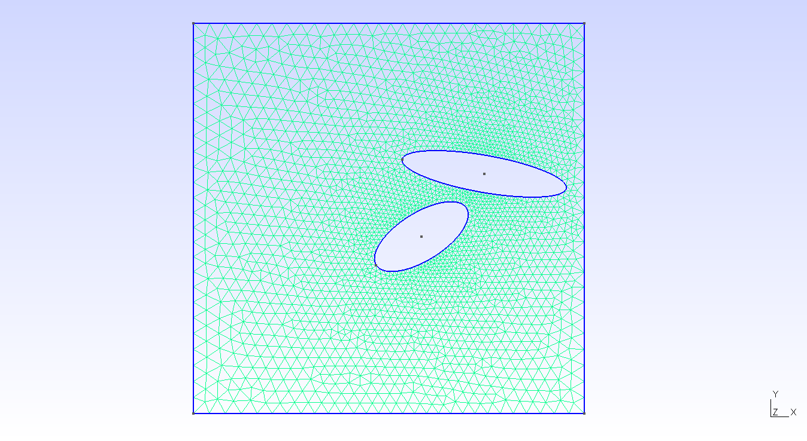

### FEM Load Cases

The contour plots show the CalculiX response for the three independent
macroscopic deformation states used during homogenization.

| Tension in $x$ (`EX`) | Tension in $y$ (`EY`) | Shear (`XY`) |
| --- | --- | --- |
| 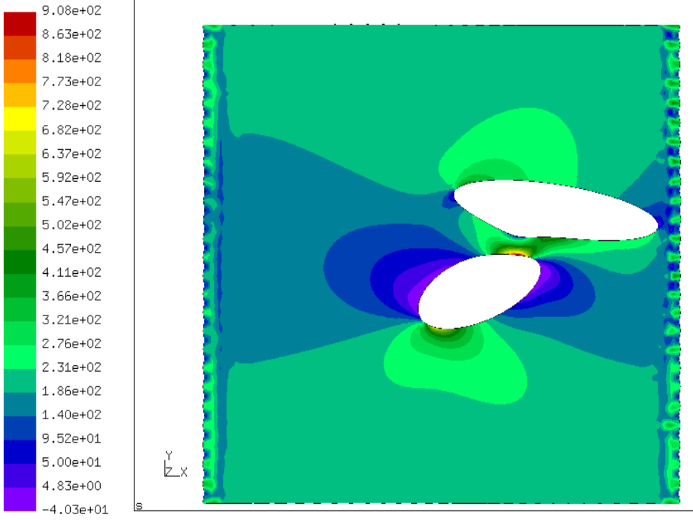 | 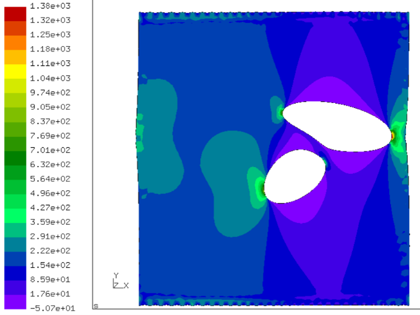 | 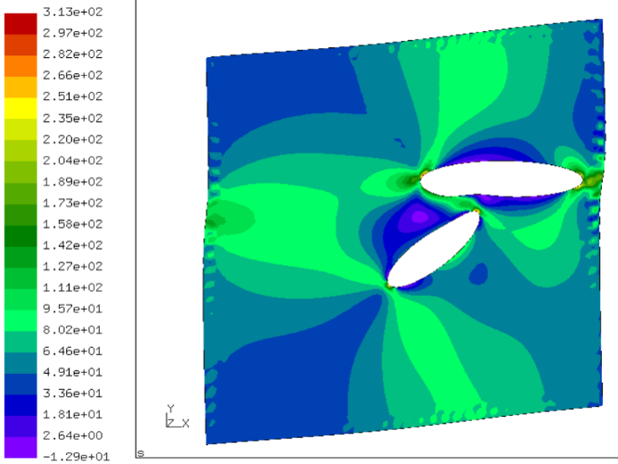 |

### FNN Training History

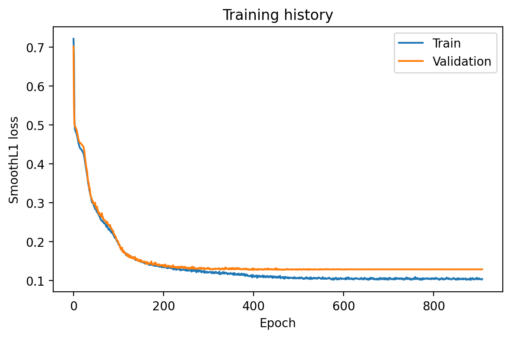

### True vs. Predicted Properties

| $E_x$ | $E_y$ |
| --- | --- |
| 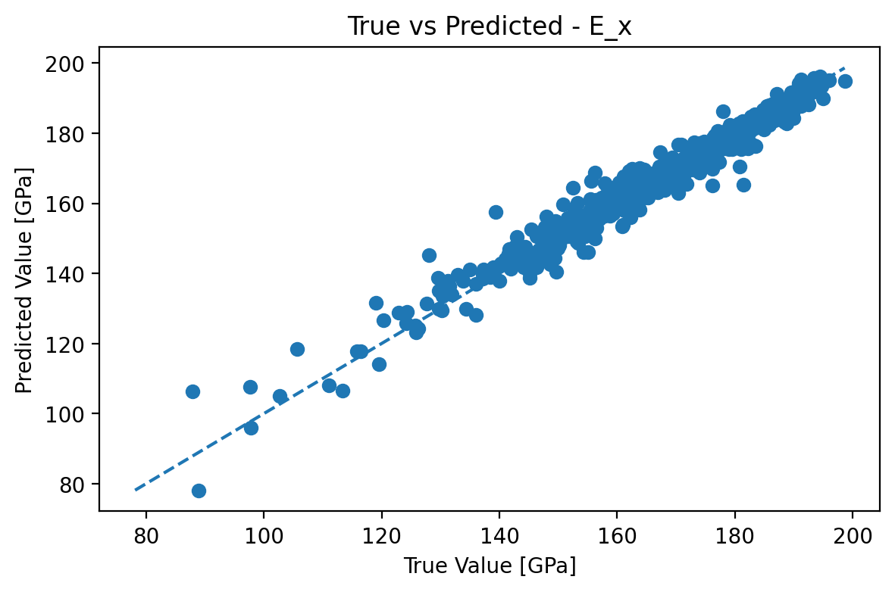 | 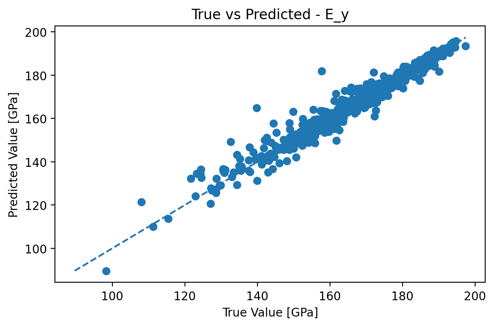 |

| $G_{xy}$ | $\nu_{xy}$ |
| --- | --- |
| 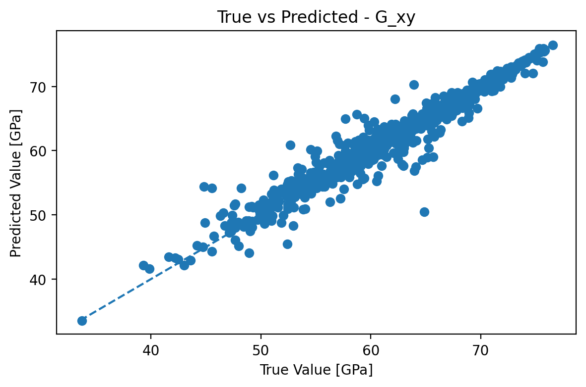 | 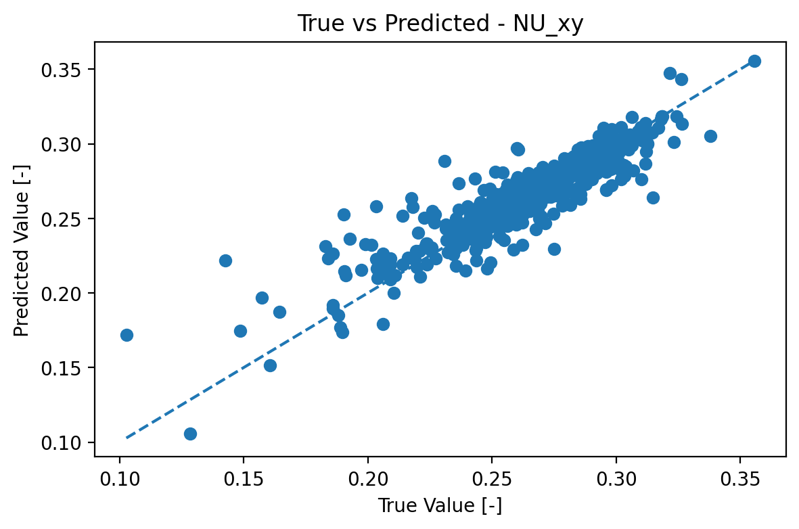 |

### Target Distributions

| $E_x$ | $E_y$ |
| --- | --- |
| 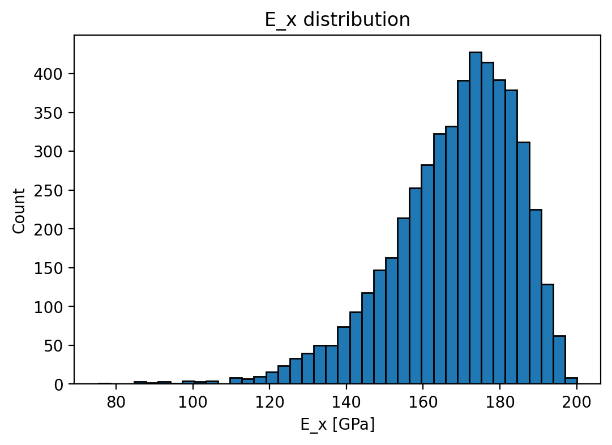 | 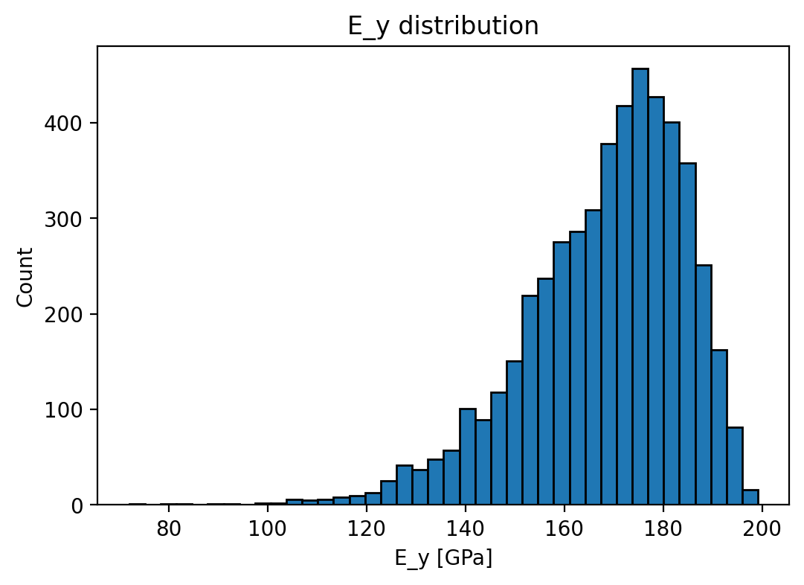 |

| $G_{xy}$ | $\nu_{xy}$ |
| --- | --- |
| 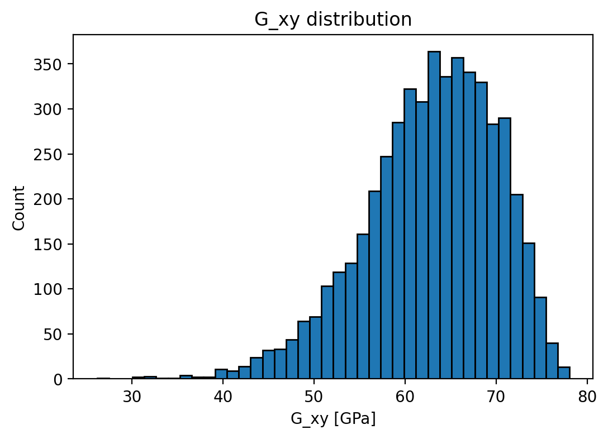 | 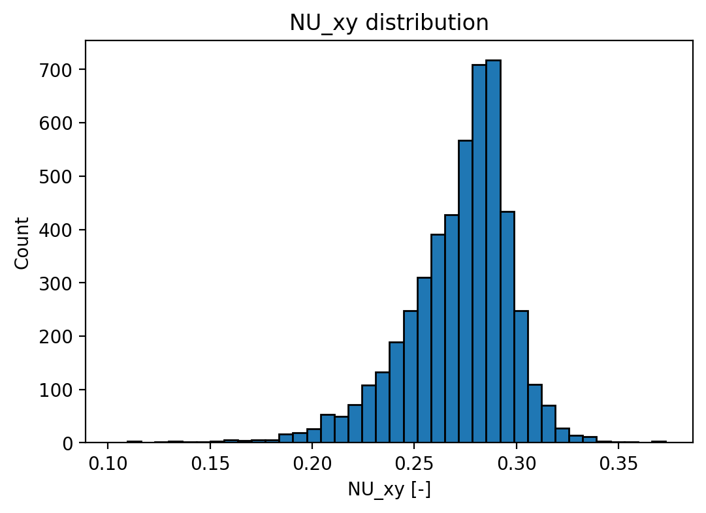 |

## Automated Checks

GitHub Actions runs the following checks on every push and pull request:

```bash
python -m ruff check Main Pipeline tests
python -m compileall -q Main Pipeline tests
python -m unittest discover -s tests -v
```

These checks cover Python syntax, undefined names and import placement, plus
normalization and rejection of invalid simulation configurations. Full FEM and
FNN training runs remain local because they require CalculiX and substantially
more compute time.

## Assumptions and Limitations

- The matrix material is isotropic and linearly elastic.
- The analysis uses small strains and plane-stress conditions.
- The current geometry contains exactly two elliptical holes.
- Invalid geometries, poor meshes, solver failures, and failed post-processing
  cases are excluded from the training dataset and recorded separately.
- Prediction accuracy is expected to deteriorate outside the training range.
- CalculiX is an external dependency and must be installed separately.

## Reproducibility

- LHS sampling is controlled by `simulation.seed`.
- Input and target scalers are fitted only on the training subset.
- The trained model and both scalers must be kept together for inference.
- The feature and target order is defined centrally in `FNN_shared.py`.
- Simulation mode is stored in the generated dataset as `dataset_mode`.

## Author

**Andrea Vinarš**  
Email: andrea.vinars3@gmail.com

## License

MIT License
